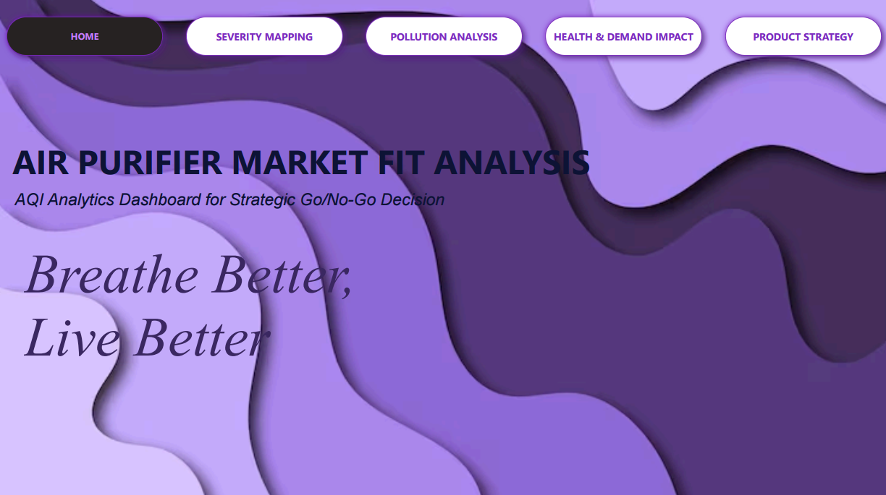
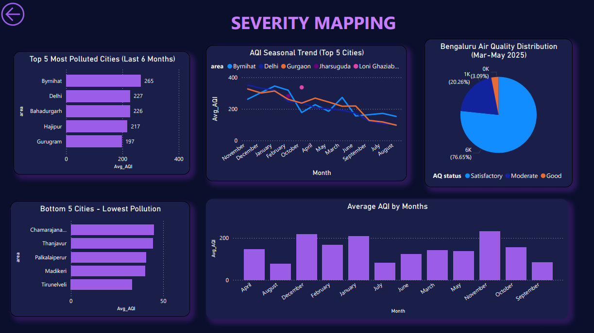
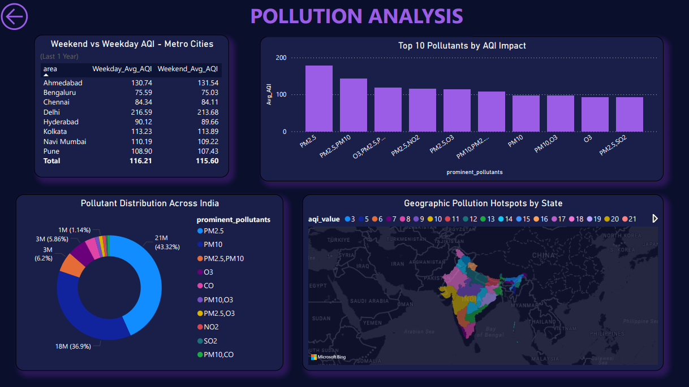
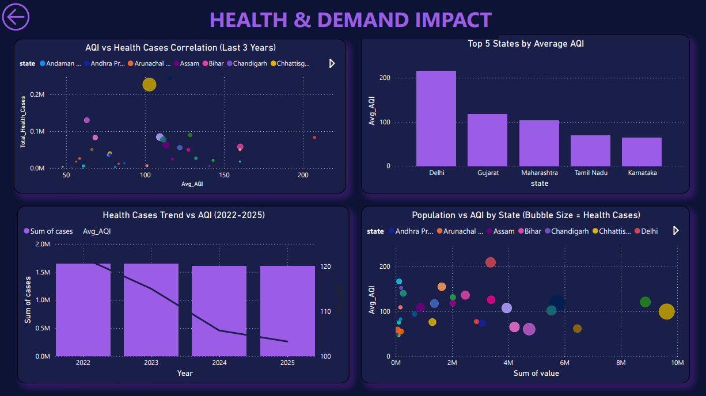
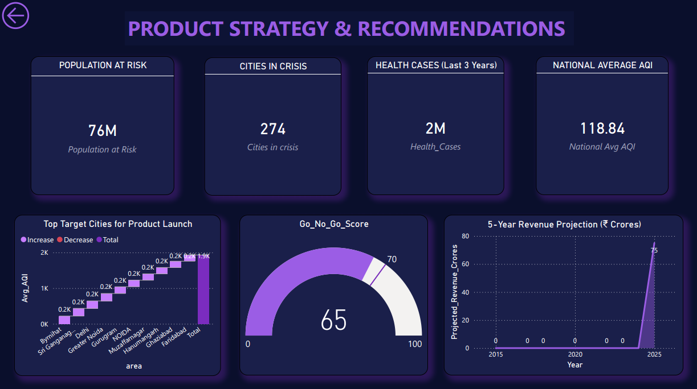

# Air Purifier Market Fit Analysis - Power BI Dashboard

## Project Overview

Power BI dashboard analyzing AQI (Air Quality Index) data across India to determine market viability for launching an air purifier product. Uses 4 years of AQI, health, vehicle, and population datasets to provide strategic go/no-go recommendation.

## Key Findings

- 76 million people live in high-pollution zones
- 274 cities exceed safe AQI limits  
- Strong AQI-health correlation: 0.72
- PM2.5 + PM10 account for 80% of pollution
- Market viability score: 65/100 (Proceed with launch)
- Year 1 revenue projection: ₹75 Crores

## Dashboard Structure

**Home Page**

**Page 1: Severity Mapping**
- Top 5 Most Polluted Cities
- AQI Seasonal Trends
- Bengaluru Air Quality Distribution
- Bottom 5 Cities Analysis
- Worst Months Heatmap

**Page 2: Pollution Analysis**
- Weekend vs Weekday AQI Comparison
- Top 10 Pollutants by Impact
- Pollutant Distribution (Pie Chart)
- Geographic Hotspots (Map)

**Page 3: Health & Demand Impact**
- AQI vs Health Cases Correlation
- Population vs AQI Analysis
- Top States by AQI
- Health Trends (2022-2025)

**Page 4: Product Strategy**
- 4 KPI Cards (Population at Risk, Cities in Crisis, Health Cases, National Avg AQI)
- Top Target Cities for Launch
- Go/No-Go Viability Score (Gauge)
- 5-Year Revenue Projection

## Data Sources

| Dataset | Records | Period | Key Columns |
|---------|---------|--------|------------|
| AQI Data | 425,971 | 2015-2025 | date, state, area, aqi_value, air_quality_status |
| Health Data | 26,553 | 2009-2025 | year, state, disease_name, cases, deaths |
| Vehicle Data | 199,552 | 2014-2025 | year, state, vehicle_class, fuel, value |
| Population Data | 8,892 | 2011-2036 | year, state, gender, value |

## Data Model

Star Schema with AQI_data as central fact table:
- dim_state (32 states/UTs)
- dim_date (3,690 dates with Year, Month, Quarter, Season hierarchies)
- AQI_data (fact table - daily measurements)
- Health_data (dimension)
- Vehicle_data (dimension)
- Population_data (dimension)

## Key DAX Measures

- Avg_AQI - Average pollution index
- Max_AQI - Maximum recorded AQI
- Count_Cities_Poor_AQI - Cities in Poor/Very Poor/Severe status
- Total_Health_Cases - Reported health cases
- Total_Deaths - Pollution-related deaths
- Weekday_Avg_AQI - Weekday pollution
- Weekend_Avg_AQI - Weekend pollution
- Go_No_Go_Score - Market viability (0-100)
- Projected_Revenue_Crores - 5-year forecast

## Data Cleaning

Power Query transformations:
- Removed 100% null columns
- Converted text dates to datetime
- Removed rows with null key values
- Standardized text casing
- Trimmed whitespace in text fields
- Filtered to relevant time periods

## Recommendations

**Priority Launch Cities:**
- Delhi (AQI: 210)
- Faridabad (AQI: 174)
- Gurugram (AQI: 188)

**Product Features:**
- Primary: PM2.5 filter (40% of pollution)
- Secondary: PM10 filter (35% of pollution)
- Premium: Real-time AQI display + app

**Peak Demand:** October-January (60% annual sales)

**Market Size:** ₹1.89 trillion TAM

## Files

- air_purifier.pbix (main file)
- air_purifier.pdf (requirements)
- Input datasets (4 Excel files)

## How to Use

1. Open air_purifier.pbix in Power BI Desktop
2. Navigate through 4 pages using tabs
3. Use slicers to filter by state/city/time period
4. Hover over visualizations for detailed tooltips

## Go/No-Go Decision

Score: 65/100 - Recommend phased launch

Scoring:
- Severity (40%): High AQI affecting 76M - STRONG
- Health Impact (30%): 2M cases - STRONG  
- Market Size (20%): 10-15M customers - STRONG
- Competition (10%): Moderate - ACCEPTABLE

Expected Year 1 revenue: ₹75 Crores
5-year projection: ₹1,700 Crores (22x growth)

## Project Learnings

- Air pollution in India is a severe crisis affecting health outcomes at scale
- Geographic and seasonal patterns are predictable, enabling targeted marketing
- Vehicle emissions are quantifiable lever for pollution control
- Market demand is highest in winter months due to pollution spikes
- Consumer awareness is high in high-pollution areas but seasonal